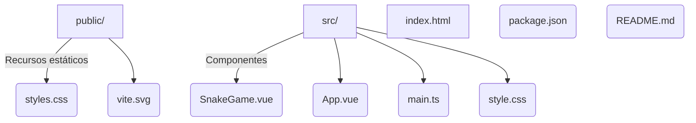

# 🐍 Snake Vue

[](https://vuejs.org/)
[](https://www.typescriptlang.org/)
[](https://vitejs.dev/)
[](https://github.com/JhonLaurens/snake-vue/actions)
[](https://github.com/JhonLaurens/snake-vue/stargazers)
[](LICENSE)

> **Snake Vue** es un juego retro online inspirado en el clásico Snake, desarrollado con Vue 3, TypeScript y Vite. Personaliza colores, juega desde cualquier dispositivo y compite por el mejor puntaje. ¡Ideal para nostálgicos, fans de juegos retro y desarrolladores Vue!

---

## 🚀 Demo en Vivo

Juega ahora 👉 [Snake Vue Online](https://jhonlaurens.github.io/snake-vue/)

---

## 🎮 Características

- ⚡️ **Rápido y responsivo**: Experiencia fluida en móviles y escritorio.
- 🎨 **Personalización**: Cambia colores de la culebra, cabeza, comida y fondo.
- 🕹️ **Controles**: Soporte para teclado y controles táctiles.
- 🏆 **Marcador y récords**: Guarda tus mejores puntajes localmente.
- 🌗 **Temas**: Oscuro, claro y más.
- 💾 **Persistencia local**: Tus récords se guardan en tu navegador.
- � **Preparado para IA**: Fácil de extender con lógica de dificultad dinámica.
- �🧩 **Código abierto**: Fácil de entender y extender.

---

## 📸 Captura de Pantalla


---

## 📦 Instalación

1. **Clona el repositorio:**

   ```sh
   git clone https://github.com/JhonLaurens/snake-vue.git
   cd snake-vue
   ```

2. **Instala dependencias:**

   ```sh
   npm install
   ```

3. **Ejecuta en modo desarrollo:**

   ```sh
   npm run dev
   ```

   Abre [http://localhost:5173](http://localhost:5173) en tu navegador.

4. **Compila para producción:**

   ```sh
   npm run build
   ```

5. **Vista previa de producción:**
   ```sh
   npm run preview
   ```

---

## 🛠️ Uso y Personalización

- **Juega** usando las flechas del teclado o los botones táctiles.
- **Personaliza** colores y tema desde el panel de opciones.
- **Consulta tus récords** y compite contigo mismo.
- **Reinicia** la partida en cualquier momento.

### 💡 Tips para personalizar el frontend

- Modifica los colores y sprites en `src/components/SnakeGame.vue`.
- Cambia estilos globales en `src/style.css` o `public/styles.css`.
- Agrega nuevos temas o animaciones usando [Vue transitions](https://vuejs.org/guide/built-ins/transition.html).
- Implementa lazy loading para componentes pesados si agregas nuevas pantallas.

---

## 🗂️ Estructura del Proyecto



---

## 🤝 Contribuciones

¡Las contribuciones son bienvenidas!  
Puedes abrir issues para sugerencias, reportar bugs o enviar un pull request con mejoras.

1. Haz un fork del repositorio.
2. Crea una rama (`git checkout -b feature/nueva-funcionalidad`).
3. Realiza tus cambios y haz commit (`git commit -am 'Agrega nueva funcionalidad'`).
4. Haz push a tu rama (`git push origin feature/nueva-funcionalidad`).
5. Abre un Pull Request.

---

## ⭐ Reseñas y Feedback

¿Te gustó el juego?

- Deja una estrella ⭐ en [GitHub](https://github.com/JhonLaurens/snake-vue).
- Comparte tu récord o sugerencia en la sección de [Issues](https://github.com/JhonLaurens/snake-vue/issues).
- ¿Ideas para mejorar? ¡Tus comentarios son bienvenidos!
- [Participa en las discusiones](https://github.com/JhonLaurens/snake-vue/discussions) o responde la [encuesta de feedback](https://forms.gle/tu-link-google-forms).

---

## 🌐 SEO

Juego retro online Snake Vue, hecho con Vue 3 y TypeScript. Juega gratis, personaliza colores, guarda tus récords y compite. ¡Ideal para nostálgicos y desarrolladores web!

---

## 📢 Sígueme y comparte

- [GitHub @JhonLaurens](https://github.com/JhonLaurens)
- [LinkedIn](https://www.linkedin.com/in/jhonlaurens/)

---

## 🧑‍💻 Mejoras sugeridas

- **Despliegue automático:**  
  Automatiza el despliegue en GitHub Pages con [vite-plugin-pwa](https://vite-pwa-org.netlify.app/) y un workflow de GitHub Actions (ver ejemplo abajo).
- **Accesibilidad:**  
  Mejora el contraste, navegación por teclado y usa roles ARIA.
- **Feedback de usuarios:**  
  Agrega un formulario de feedback o usa [GitHub Discussions](https://github.com/JhonLaurens/snake-vue/discussions).
- **Analytics:**  
  Integra [Plausible](https://plausible.io/) o [Umami](https://umami.is/) para estadísticas de uso (sin cookies).

---

## 🛡️ Seguridad

- No expongas llaves ni datos sensibles en el frontend.
- Si usas backend para récords, valida y sanitiza toda la entrada.
- Usa dependencias actualizadas (`npm audit`).

---

## 🤖 IA y Dificultad Dinámica

¿Quieres experimentar con IA?  
Puedes agregar lógica para ajustar la velocidad o la aparición de obstáculos según el desempeño del jugador. Ejemplo:

- Detecta patrones de movimiento y aumenta la dificultad si el jugador lo hace muy bien.
- Usa un simple algoritmo para predecir colisiones y dar tips.

---

## 🧪 Pruebas

Para escalar el proyecto, considera usar [Vitest](https://vitest.dev/) para pruebas unitarias:

- Lógica de movimiento de la serpiente.
- Detección de colisiones.
- Persistencia de récords.

Ejemplo de test:

```ts
import { describe, it, expect } from "vitest";
// ...test de movimiento...
```

---

## 🗄️ Persistencia avanzada (opcional)

¿Quieres guardar récords en la nube?

- [Supabase](https://supabase.com/) o [Firebase](https://firebase.google.com/) son opciones sencillas para almacenar puntajes y rankings globales.

---

## ⚡ Optimización para producción

- Usa imágenes SVG optimizadas y minimiza assets en `public/`.
- Activa minificación y splitChunks en Vite.
- Considera lazy loading si agregas más componentes.
- Usa [vite-plugin-compress](https://github.com/alloc/vite-plugin-compress) para comprimir assets.

---

## 🛠️ CI/CD con GitHub Actions

Agrega este workflow (`.github/workflows/ci.yml`):

```yaml
name: CI
on:
  push:
    branches: [main]
  pull_request:
    branches: [main]
jobs:
  build:
    runs-on: ubuntu-latest
    steps:
      - uses: actions/checkout@v4
      - uses: actions/setup-node@v4
        with:
          node-version: 20
      - run: npm ci
      - run: npm run build
```

---

## � Instalación y configuración

1. **Clona el repositorio:**

   ```sh
   git clone https://github.com/JhonLaurens/snake-vue.git
   cd snake-vue
   ```

2. **Crea tu proyecto en [Supabase](https://supabase.com/):**
   - Crea una tabla llamada `scores` con los campos: `id` (uuid, PK), `player` (text), `score` (integer), `created_at` (timestamp, default now()).
   - Habilita RLS (Row Level Security) y permite solo inserción y lectura pública.
   - Copia tu `Project URL` y `anon public key`.

3. **Configura tus variables de entorno:**
   - Copia `.env.example` a `.env` y coloca tus claves de Supabase:
     ```env
     VITE_SUPABASE_URL=tu-url-supabase
     VITE_SUPABASE_ANON_KEY=tu-anon-key
     ```

4. **Instala dependencias:**

   ```sh
   npm install
   ```

5. **Ejecuta en modo desarrollo:**

   ```sh
   npm run dev
   ```

   Abre [http://localhost:5173](http://localhost:5173) en tu navegador.

6. **Compila para producción:**

   ```sh
   npm run build
   ```

7. **Vista previa de producción:**
   ```sh
   npm run preview
   ```

---

## 🔒 Seguridad y buenas prácticas

- **Nunca subas tu archivo `.env` real al repositorio.**
- Limita la frecuencia de inserciones desde el frontend para evitar spam.
- Usa políticas RLS estrictas en Supabase para evitar modificaciones no deseadas.

---
